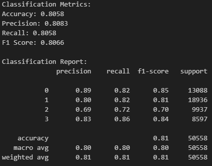
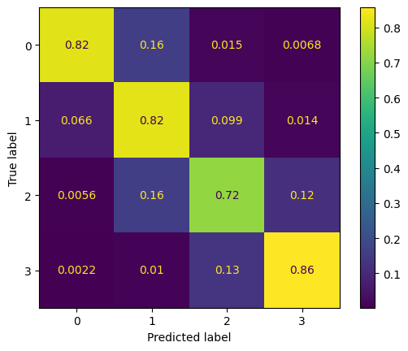
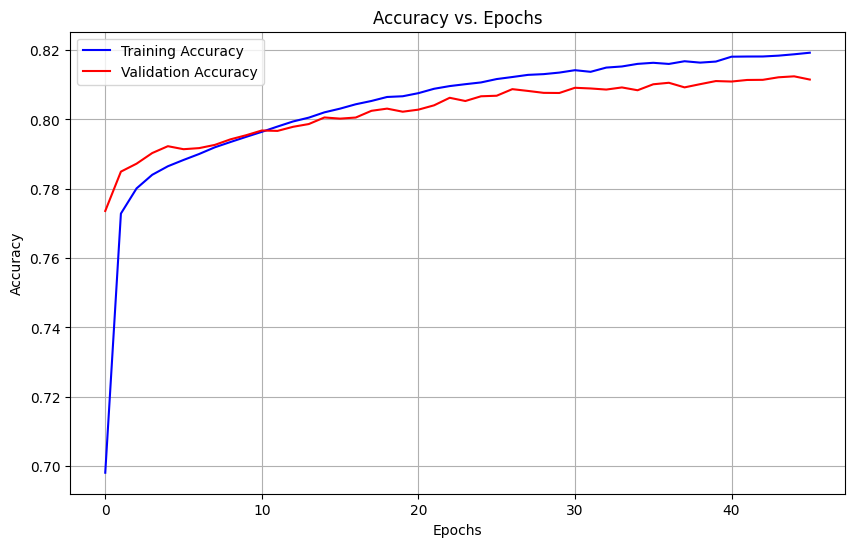
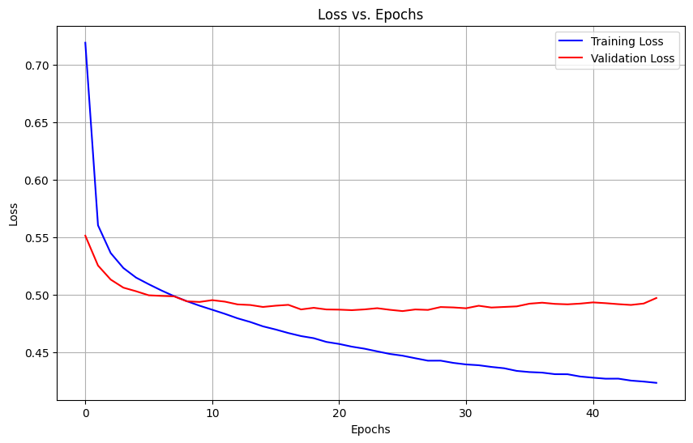

# Timeseries Energy Consumption

Using a temporal convolutional network to classify future energy consumption

Original dataset can be found here: https://huggingface.co/datasets/EDS-lab/electricity-demand

## Installation Setup

- Hardware
  - Developed under Windows with Nvidia 3080ti
- Software
  - Python 3.9.2
    - If using `pyenv`, use:
      ```bash
      pyenv install 3.9.2
      pyenv local 3.9.2
      ```
    - **Install dependencies**:
      ```bash
      pip install --upgrade pip
      pip install -r requirements.txt
      ```
    - **Or install dependencies manually, as long as Python==3.9.2**:
      ```bash
      pip install --upgrade pip
      pip install keras_tcn==3.5.0 matplotlib==3.9.3 numpy==2.1.3 pandas==2.2.3 scikit_learn==1.5.2 tensorflow==2.10.1 tensorflow-addons==0.22.0 pyarrow==18.0.0 jupyter
      ```

## Usage and Results

### There are three main notebooks: `TCN.ipynb`, `expirement.ipynb`, `data_handeling.ipynb`

- To quickly see the results and see accuracy, precision, recall and F-1 score head to `expirement.ipynb`.
- To see the source as to how the network was trained or feature engineering head to `TCN.ipynb`.
- To see how the data was handeled and resampled head to `data_handeling.ipynb`.
- Full file structure and directory is found at the end of the `README.md`

Please be aware the original parquet files are not located in this repository thus they need to be downloaded before running data_handeling.

### To reproduce the results
- Open `experiment.ipynb` and run the cells to reproduce the experiment results.
  - It will be setup to run the final expirement results which will be the `tcn_model_0.8_4.h5`, these are what the report is based off of.
  - The classes were 0 <= 28, 28 <= 56, 56 <= 84, and > 84 all in kWh. These metrics were taken from ofgem.gov.uk, Great Britain’s independent energy regulator with slight changes due to different years. Important to note, this is for weekly samples.
  - Produces the following metrics: accuracy, precision, recall, and F-1 for each class label. Additionally display a confusion matrix.
    
  [](logging_images/classification_metrics_and_report.png)
  [](logging_images/confusion_matrix.png)

  - Can additionally check `logging_images/` to see the accuracy and loss versus epochs while training
    
  [](logging_images/acc_vs_epoch_0.8_4.png)
  [](logging_images/loss_vs_epoch_0.8_4.png)

  - Note while `tcn_model_0.8_4.h5` is the final and main expirement, older TCN models in the `saved_model/old_models/` can be also ran to see the affects of data size and window sizes. Overall, `tcn_model_0.8_4.h5` resulted in the best results for the task. The name scheme follows `tcn_model_datasetsize_windowsize.h5`
 
### To inspect source code
- `TCN.ipynb` holds the model training code, metrics output, and some additional feature engineering. If using Python version 3.9.2 and tensorflow version 2.10.1 the file can be ran. The lastest training session was saved to output and can be inspected.
- `data_handeling.ipynb` holds most of the dataset merging and feature engineering. Orignial datsets were quite large so fully merging them was not possible with the avaliable compute power. File additionally shows the majority of the feature engineering done.
- The saved datasets will be located in the `data/` folder.

## **File & Directory Structure**
- **`TCN.ipynb`: source code for how the model was trained and feature engineering**
- **`experiment.ipynb`: the main experiment script to see results of TCN model**
- **`data_handeling.ipynb`: data script that was used for resampling. To run this script please download the original set from huggingface linnked at the top**
- `requirements.txt`: contains all the necessary libraries that need to be install to run the project
- `data/`: core datasets not here but can be found in the huggingface link
  - `demand_weather_merged_0.5.parquet`: Combined datasets. Sampled at 50% of total data due to memory constraints.
  - `demand_weather_merged_0.5.parquet`: Combined datasets. Sampled at 80% of total data.
- `logging_images/`: containing all training images
  - `other_test_imgs/`: images from previous training that was worth keeping
    - `0.5_4/`: 50% dataset at 4 weeks
      - `acc_vs_epoch_0.5_4.png`
      - `loss_vs_epoch_0.5_4.png`
    - `0.5_12/`: 50% dataset at 12 weeks
      - `acc_vs_epoch_0.5_12.png`
      - `loss_vs_epoch_0.5_12.png`
    - `0.8_12/`: 80% dataset at 12 weeks
      - `acc_vs_epoch_0.8_12.png`
      - `loss_vs_epoch_0.8_12.png`
  - `classification_metrics_and_report.png`: final expirement metrics
  - `confusion_matrix.png`: final expirement confusion matrix
  - `acc_vs_epoch_0.8_4.png`: final expirement accuracy vs epoch test
  - `loss_vs_epoch_0.8_4.png`: final expirement loss vs epoch test
- `saved_model/`: contains the final model and old saved models
  - `old_models/`: previous models that were worth saving
    - `tcn_model_0.5_4.h5`
    - `tcn_model_0.5_12.h5`
    - `tcn_model_0.8_12.h5`
  - `tcn_model_0.8_4.h5`: model used for expirement and project results
- `README.md`
- `.gitignore`

